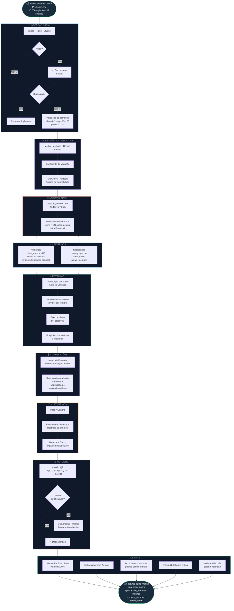
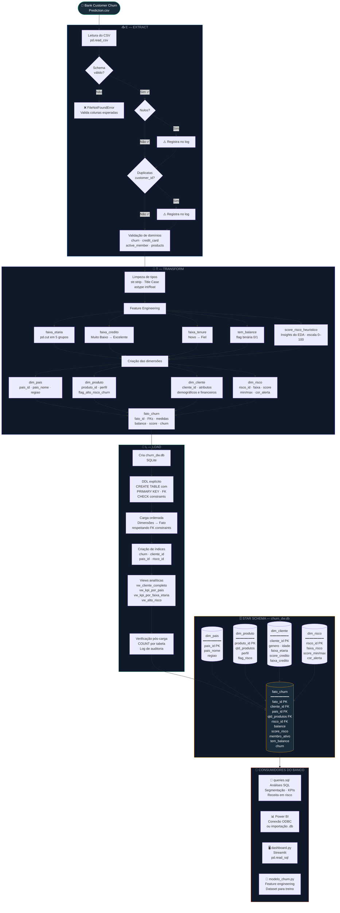

# Flowcharts — Churn Prediction Pipeline
> Diagramas técnicos do projeto. 

---

## 1. EDA — Análise Exploratória de Dados

---

## 2. ETL — Pipeline e Consumo do Banco

---

## 3. Modelo — Pipeline de Machine Learning

```mermaid
flowchart TD
    IN([🗂️ churn_dw.db\nou CSV fallback\n10.000 registros]) --> PP

    subgraph PREPROC["⚙️ PRÉ-PROCESSAMENTO"]
        PP[Drop customer_id\nnão é feature preditiva] --> PP2[Label Encoding\ncountry · gender\nLabelEncoder] 
        PP2 --> PP3[Separação\nX = features\ny = churn target]
        PP3 --> PP4[Train/Test Split\n70% treino · 30% teste\nstratify=y · random_state=42]
        PP4 --> PP5[StandardScaler\nfit no treino\ntransform no teste\nSÓ para Regressão Logística\nevita data leakage]
    end

    PP5 --> TRAIN

    subgraph TRAIN["🏋️ TREINAMENTO — 4 MODELOS"]
        M1[Regressão Logística\nBaseline · interpretável\nmax_iter=1000]
        M2[Random Forest\n200 árvores · max_depth=10\nBagging · n_jobs=-1]
        M3[Gradient Boosting\n200 estimadores · lr=0.05\nBoosting sequencial]
        M4[XGBoost\n200 rounds · subsample=0.8\ncolsample=0.8 · regularização L1/L2]
    end

    M1 & M2 & M3 & M4 --> EVAL

    subgraph EVAL["📊 AVALIAÇÃO"]
        EVAL1[Classification Report\nPrecision · Recall · F1\npor classe] --> EVAL2[AUC-ROC\nMétrica principal\nrobusta ao desbalanceamento]
        EVAL2 --> EVAL3[Ranking comparativo\nGradient Boosting 0.8756\nXGBoost         0.8752\nRandom Forest   0.8736\nReg. Logística  0.7817]
        EVAL3 --> EVAL4[Validação Cruzada\n5-fold KFold\nMédia ± desvio padrão\nestabilidade do modelo]
    end

    EVAL4 --> BEST

    BEST([🥇 Melhor modelo\nGradient Boosting\nAUC = 0.8756]) --> THRESH & FI

    subgraph THRESH["🎯 AJUSTE DE THRESHOLD"]
        T1[Curva Precision-Recall\npara cada threshold possível] --> T2[Calcula F1 da classe Churn\nem cada ponto]
        T2 --> T3[Threshold ótimo\nmaximiza F1 do Churn\n≈ 0.32–0.35]
        T3 --> T4[Recall churn\n0.49 → 0.65–0.70\nmelhor detecção de risco]
        T4 --> T5[Comparação\nMatriz de confusão\n0.5 vs threshold ótimo]
    end

    subgraph FI["🔍 INTERPRETABILIDADE"]
        F1[Feature Importance\nGradient Boosting\nDecreasing by impurity] --> F2[Top features:\nage · active_member\nbalance · products_number\ncredit_score]
    end

    T5 & F2 --> PROD

    subgraph PROD["🚀 PRODUÇÃO"]
        P1[Aplica modelo\nem toda a base\n10.000 clientes] --> P2[Gera colunas:\nprob_churn 0–1\nscore_risco 0–1000\nfaixa_risco Baixo/Médio/Alto/Crítico]
        P2 --> P3[Serialização\njoblib.dump\nmodelo_churn.pkl\nmodelo + scaler + threshold + features]
        P3 --> P4[Export\nclientes_score_powerbi.csv\npronto para Power BI]
        P3 --> P5[Uso em produção\ncarregar pkl\nprever novos clientes\nsem retreinar]
    end

    P4 --> OUT1([📊 Power BI\nDashboard da diretoria\nscore por cliente])
    P5 --> OUT2([🖥️ Streamlit\nDashboard interativo\nalertas em tempo real])

    style IN fill:#1a2d3d,stroke:#1D9E75,color:#fff
    style BEST fill:#1a2d3d,stroke:#F59E0B,color:#fff
    style OUT1 fill:#1a2d3d,stroke:#1D9E75,color:#fff
    style OUT2 fill:#1a2d3d,stroke:#3B8BD4,color:#fff
    style PREPROC fill:#0f1929,stroke:#3B8BD4,color:#9ca3af
    style TRAIN fill:#0f1929,stroke:#7F77DD,color:#9ca3af
    style EVAL fill:#0f1929,stroke:#1D9E75,color:#9ca3af
    style THRESH fill:#0f1929,stroke:#F59E0B,color:#9ca3af
    style FI fill:#0f1929,stroke:#E8593C,color:#9ca3af
    style PROD fill:#0f1929,stroke:#1D9E75,color:#9ca3af
```

